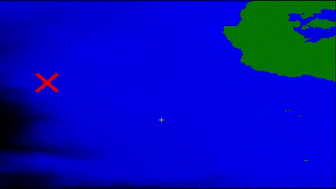
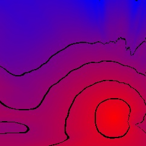

Prerequisites
------------
* Download a python editor
* Download the following libraries : cv2, numpy, pandas
```
pip install opencv-python
pip install numpy
pip install pandas
```

Getting started with the interface
------------
1. Keyboard
    * r : reset batymetry picture
    * v : change version of gif : time or propagation percentage (default option : time)
    * d : clear data informations (distance, time, speed)
    * esc : quit the app

2. Mouse </br>
Click to put a cross on the batymetry.
</br></br>
The clicks work by pair :
   * First click : starting point of the tsunami
   * Second click : point to be reached
</br>
   
When you clicked for the second time and line will be drawn between the 2 points and the mid-speed, the time and
the distance will be displayed on the left down corner.
Then you can start again with 2 new points.
</br>



>[!IMPORTANT]  
> On each first click the cross will not be displayed instantly because of the calculation.
> </br>Please be patient and do not click until the red cross is showed.

Few moments after the first click a second window will open.
On this window you can see the time of propagation through percentage or time (second) (depends on the option chosen).
</br>
>[!TIP] 
> </br>
> <p align="center">
>  </p>
>
> Interpretation : </br>
>$${\color{red}Red }$$ : Less than 1s
></br>$${\color{purple}Purple }$$ : mid-time
></br>$${\color{blue}Blue }$$ : Few seconds
